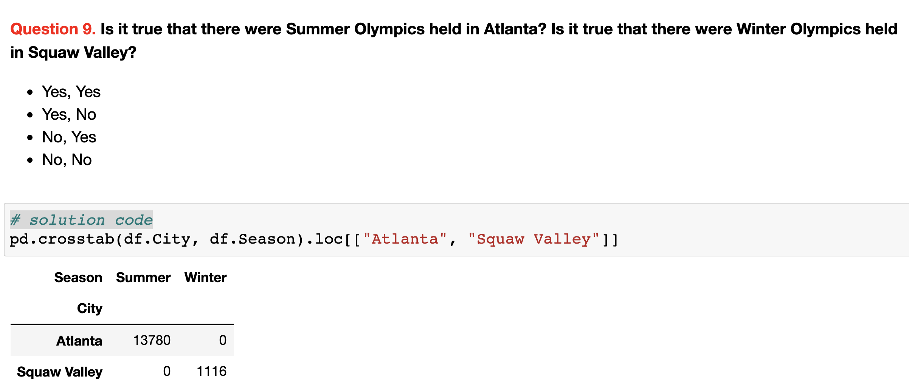

(assignment01_intro)=

# Topic 1. Exploratory Data Analysis 

 

 

You definitely want to immediately jump into Machine Learning and see math in action. But 70-80% of the time working on a real project is fussing with data, and here Pandas is very helpful, I use it in my work almost every day. This article describes the basic Pandas methods for preliminary data analysis. Then we analyze the dataset on the churn of telecom customers and try to predict churn without any model training, simply relying on common sense (and Pandas of course). By no means should you underestimate such an approach.

1. Read the [article](https://mlcourse.ai/articles/topic1-exploratory-data-analysis-with-pandas/) (same in a form of a [Kaggle Notebook](https://www.kaggle.com/kashnitsky/topic-1-exploratory-data-analysis-with-pandas))
1. Watch a [video lecture](https://youtu.be/fwWCw_cE5aI)
1. Complete [demo assignment 1](https://www.kaggle.com/kashnitsky/assignment-1-pandas-and-uci-adult-dataset) where you'll be exploring demographic data (UCI "Adult"), and (opt.) check out the [solution](https://www.kaggle.com/kashnitsky/a1-demo-pandas-and-uci-adult-dataset-solution) 

## Bonus Assignment 1. Exploratory Data Analysis (EDA) of Olympic games with Pandas

 

Here you'll be analyzing the history of Olympic Games with Pandas. Below is an example of one of the questions:

 

