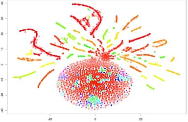

(assignment02_intro)=

# Topic 2. Visual Data Analysis

 

 

The role of visual data analysis is hard to overestimate, this is how new insights are found in data and how features are engineered. Here we discuss main data visualization techniques and how they are applied in practice. Also take a sneak peek into multidimensional feature space using the t-SNE algorithm, which sometimes is useful but mostly just draws such Christmas tree decorations.

1. Read two articles: ["Visual data analysis in Python"](https://mlcourse.ai/articles/topic2-visual-data-analysis-in-python/) (same as a [Kaggle Notebook](https://www.kaggle.com/kashnitsky/topic-2-visual-data-analysis-in-python)) and ["Overview of Seaborn, Matplotlib and Plotly libraries"](https://mlcourse.ai/articles/topic2-part2-seaborn-plotly/) (same as a [Kaggle Notebook](https://www.kaggle.com/kashnitsky/topic-2-part-2-seaborn-and-plotly))
1. Watch a [video lecture](https://www.youtube.com/watch?v=WNoQTNOME5g)
1. Complete [demo assignment 2](https://www.kaggle.com/kashnitsky/a2-demo-analyzing-cardiovascular-data) where you'll be analyzing cardiovascular disease data, and (opt.) check out the [solution](https://www.kaggle.com/kashnitsky/a2-demo-analyzing-cardiovascular-data-solution) 

## Bonus Assignment 2. Exploratory Data Analysis (EDA) of US flights with Pandas, Matplotlib, and Seaborn 

Here you'll be performing EDA of a much larger dataset of US flights sometimes attending to the performance of basic operations.
