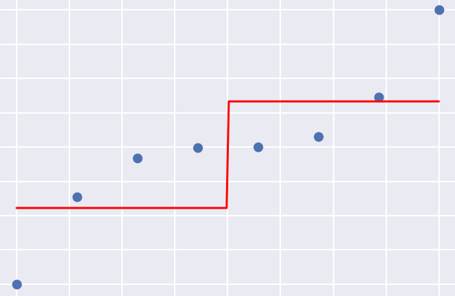
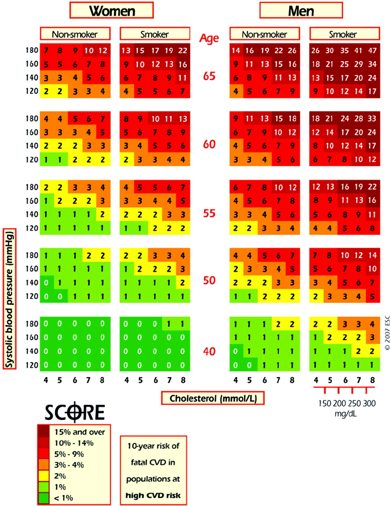
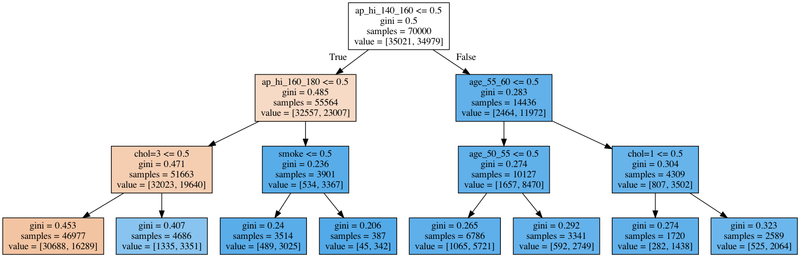

(assignment03_intro)=

# Topic 3. Classification, Decision Trees, and k Nearest Neighbors

 

 

Here we delve into machine learning and discuss two simple approaches to solving the classification problem. In a real project, you'd better start with something simple, and often you'd try out decision trees or nearest neighbors (as well as linear models, the next topic) right after even simpler heuristics. We discuss the pros and cons of trees and nearest neighbors. Also, we touch upon the important topic of assessing the quality of model predictions and performing cross-validation. The article is long, but decision trees, in particular, deserve it – they make a foundation for Random Forest and Gradient Boosting, two algorithms that you'll be likely using in practice most often.  

1. Read the [article](https://mlcourse.ai/articles/topic3-dt-knn/) (same as a [Kaggle Notebook](https://www.kaggle.com/kashnitsky/topic-3-decision-trees-and-knn))
1. Watch a video lecture coming in 2 parts: the [theory](https://youtu.be/H4XlBTPv5rQ) behind decision trees, an intuitive explanation, and [practice](https://youtu.be/RrVYO6Td9Js) with Sklearn decision trees
1. Complete [demo assignment 3](https://www.kaggle.com/kashnitsky/assignment-3-decision-trees) on decision trees, and (opt.) check out the [solution](https://www.kaggle.com/kashnitsky/a3-demo-decision-trees-solution) 

## Bonus Assignment 3. Decision trees for classification and regression

In this assignment, we'll go through the math and code behind decision trees applied to the regression problem, some toy examples will help with that. It is good to understand this because the regression tree is the key component of the gradient boosting algorithm which we cover at the end of the course.

    

        
        
Building a regressin tree; step 1

    

    

        
        
Building a regressin tree; step 3

    

            

Further, we apply classification decision trees to cardiovascular desease data. 

    

        
        
Risk of fatal cardiovascular disease

    

    

        
        
A decision tree fit to cardiovascular disease data

    

              

In one more bonus assignment, a more challenging one, you'll be guided through an **implementation of a decision tree from scratch**. You'll be given a template for a general `DecisionTree` class that will work both for classification and regression problems, and then you'll be testing the implementation with a couple of toy- and actual classification and regression tasks. 

 

