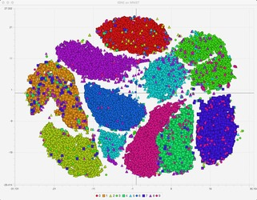
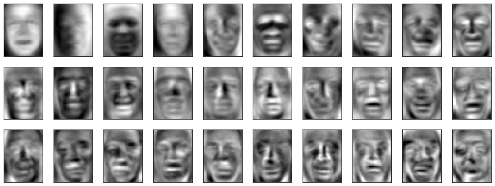
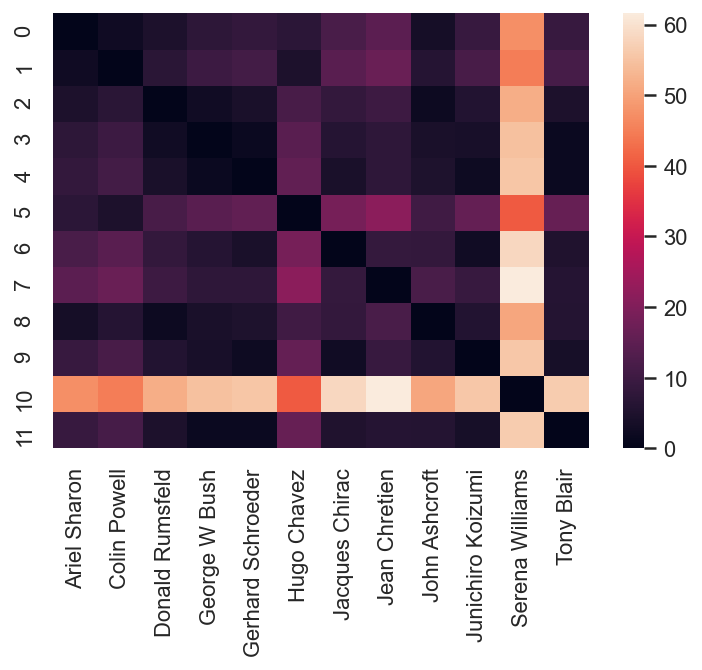
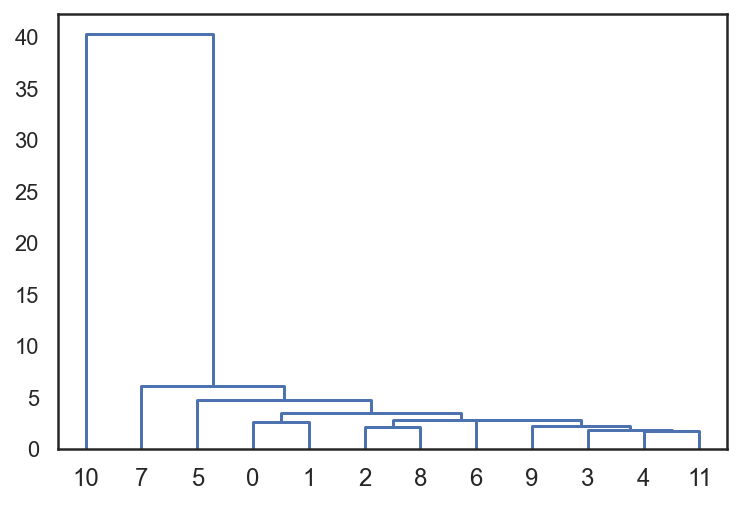

(assignment07_intro)=

# Topic 7. Unsupervised Learning: Principal Component Analysis and Clustering

  

 

Here we turn to the vast topic of unsupervised learning, it's about the cases when we have data but it is unlabeled with no target feature to predict like in classification/regression tasks. Most of the data out there is unlabeled, and we need to be able to make use of it. We discuss only 2 types of unsupervised learning tasks – clustering and dimensionality reduction. 

1\. Read the [article](https://mlcourse.ai/articles/topic7-unsupervised/) (same in a form of a [Kaggle Notebook](https://www.kaggle.com/kashnitsky/topic-7-unsupervised-learning-pca-and-clustering))

2\. Watch a video lecture coming in 2 parts:
 - ["Principal Component Analysis"](https://youtu.be/-AswHf7h0I4)
 - ["Clustering"](https://youtu.be/eVplCo-w4XE)
 
3\. Complete [demo assignment 7](https://www.kaggle.com/kashnitsky/assignment-7-unupervised-learning) where you analyze data coming from mobile phone accelerometers and gyroscopes to cluster people into different types of physical activities, and (opt.) check out the [solution](https://www.kaggle.com/kashnitsky/a7-demo-unsupervised-learning-solution) 

## Bonus Assignment 7. Principal Component Analysis and Clustering

In this assignment, we walk through `Sklearn` built-in implementations of dimensionality reduction and clustering methods and apply these techniques to the popular "faces" dataset. 

 

  

Faces: principal components

 

    

        
        
Clustering faces: pairwise similarities

    

    

        
        
Clustering faces: a dendrogram

    

