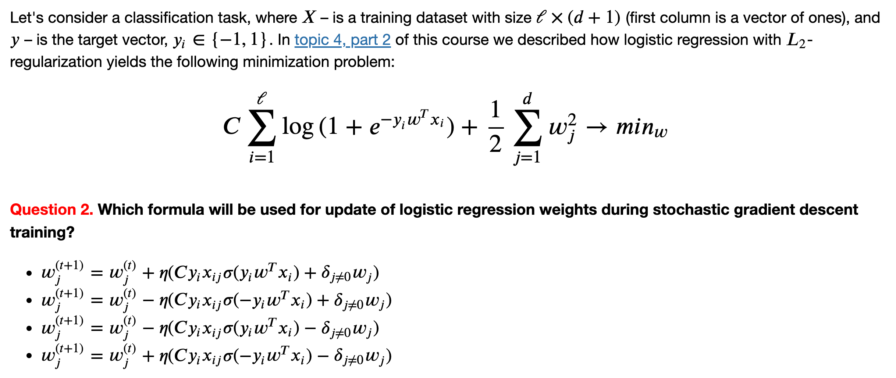
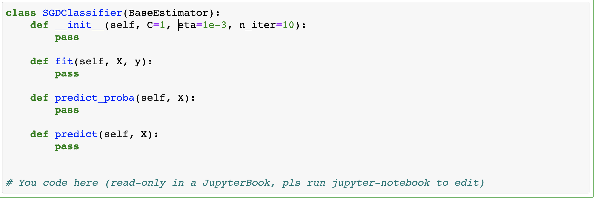

(assignment08_intro)=

# Topic 8. Stochastic Gradient Descent for regression and classification

  

 

The theoretical part here covert the analysis of Stochastic Gradient Descent, it was this optimization method that made it possible to successfully train both neural networks and linear models on really large training sets. Here we also discuss what can be done in cases of millions of features in a supervised learning task ("hashing trick") and move on to Vowpal Wabbit, a utility that allows you to train a model with gigabytes of data in a matter of minutes, and sometimes of acceptable quality. We consider several cases including StackOverflow questions tagging with a training set of several gigabytes. 

1\. Read the [article](https://mlcourse.ai/articles/topic8-sgd-vw/) (same in a form of a [Kaggle Notebook](https://www.kaggle.com/kashnitsky/https://www.kaggle.com/kashnitsky/topic-8-online-learning-and-vowpal-wabbit))

2\. Watch a video lecture coming in 2 parts:
 - ["Stochastic Gradient Descent"](https://youtu.be/EUSXbdzaQE8)
 - ["Vowpal Wabbit"](https://www.youtube.com/watch?v=gyCjancgR9U)
 
3\. Complete [demo assignment 8](https://www.kaggle.com/kashnitsky/assignment-8-implementing-online-regressor) "Implementing online regressor" which walks you through implementation from scratch, very good for the intuitive understanding of the algorithm. Optionally, check out the [solution](https://www.kaggle.com/kashnitsky/a8-demo-implementing-online-regressor-solution) 

## Bonus Assignment 8. Implementing Stochastic Gradient Descent for regression and classification

Here we go through the math implement two algorithms – a regressor and a classifier – driven by stochastic gradient descent (SGD). Here's an example of one of the math questions:

  

 

  

 
