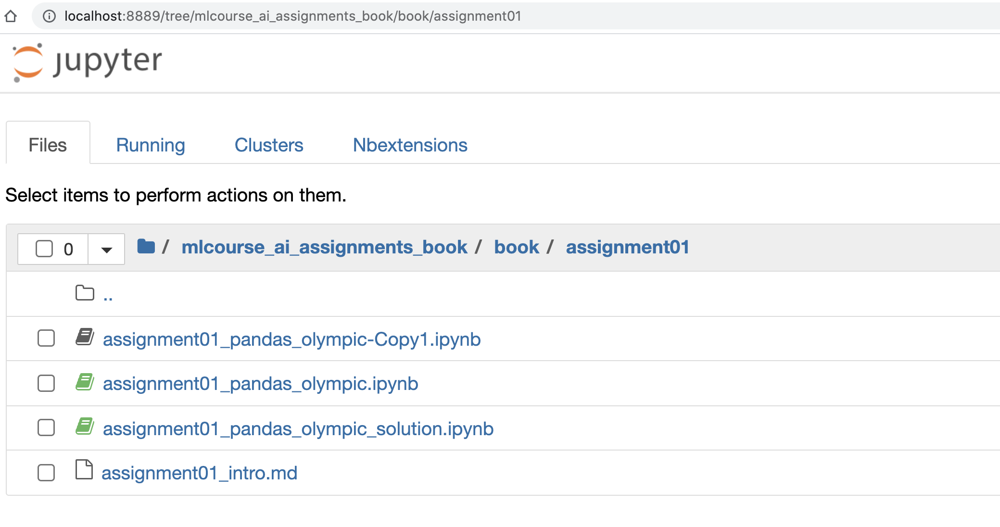

[mlcourse.ai](https://mlcourse.ai) – Open Machine Learning course. __Bonus assignments__

# Welcome

Hi! In this [mlcourse.ai](https://mlcourse.ai) JupyterBook you'll find your Bonus Assignments. The book is organized in 10 topics closely following the publicly available [mlcourse.ai roadmap](https://mlcourse.ai/roadmap). In each section, you'll find a short intro to the topic (with links to the corresponding course materials), an assignment, and a solution to the assignment. 

Note that JupyterBook is read-only. So the best way to work with the assignments is to run `jupyter-notebook` from the root directory `mlcourse_ai_assignments_book`, and then make a copy of the notebook to work with as shown below. 

## Managing dependencies

You can either install the dependencies manually from the `pyproject.toml` file or use [Poetry](https://python-poetry.org/).

- `poetry install` – installs the dependencies from the provided `poetry.lock` file
- `poetry run jupyter-notebook` – runs `jupyter-notebook` in the virtual environment managed py Poetry   
- `poetry run jupyter-book build .` – builds the Jupyter book and wtites static HTML files to the `_build` folder. 

**Thanks for supporting the course and happy learning!**