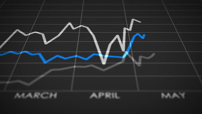

(topic09_intro)=

# Topic 9. Time Series Analysis with Python

 

Here we discuss various approaches to working with time series: what types of data preparation is necessary, how to get short-term and long-term predictions. We walk through different time series models, from simple moving average to ARIMA and to general machine learning models with specific feature engineering. We also take a look at the ways to search for anomalies in time series and discuss pros and cons of these methods.

## Steps in this block

1\. Read 2 articles:
 - ["Time series analysis in Python"](topic09_part1) (same as a [Kaggle Notebook](https://www.kaggle.com/kashnitsky/topic-9-part-1-time-series-analysis-in-python));
 - ["Predicting future with Facebook Prophet"](topic09_part2) (same as a [Kaggle Notebook](https://www.kaggle.com/kashnitsky/topic-9-part-2-time-series-with-facebook-prophet));

2\. Watch a [video lecture](https://youtu.be/_9lBwXnbOd8) on time series (optional);

3\. Complete [demo assignment 9](assignment09) on time series analysis in Python (same as a [Kaggle Notebook](https://www.kaggle.com/kashnitsky/a9-demo-time-series-analysis));

4\. Check out the [solution](assignment09_solution) (same as a [Kaggle Notebook](https://www.kaggle.com/kashnitsky/a9-demo-time-series-analysis-solution)) to the demo assignment (optional);

5\. Complete [Bonus Assignment 9](bonus09) where you'll engineer some features and apply a m achine learning model to a time series prediction task (optional, available under Patreon ["Bonus Assignments" tier](https://www.patreon.com/ods_mlcourse)).
