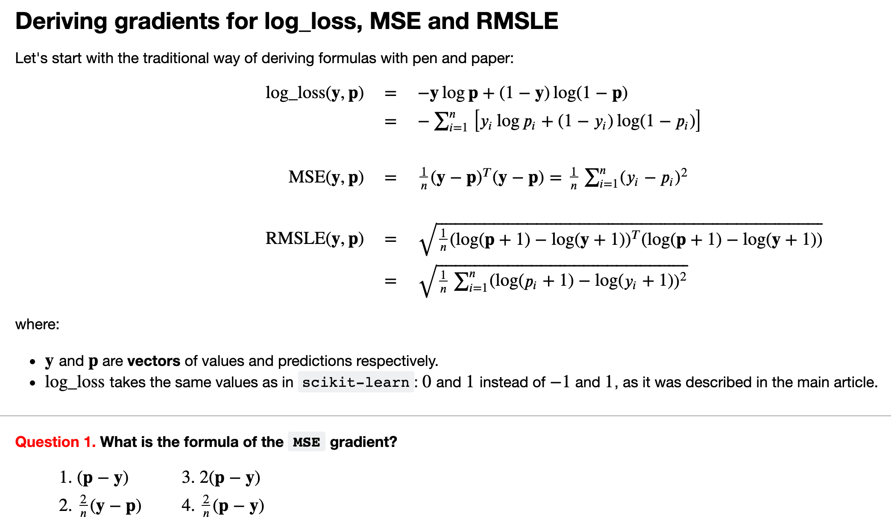
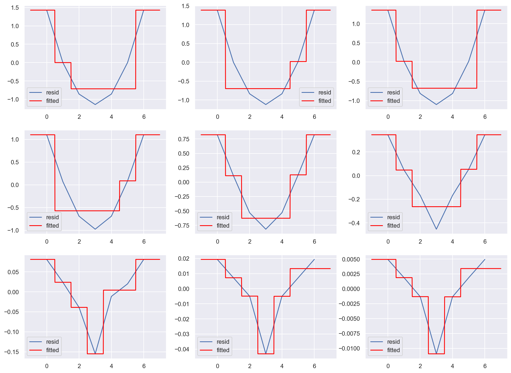

(bonus10)=

# Bonus Assignment 10

```{figure} /_static/img/topic10-teaser.jpeg
:width: 200px
```

You can purchase a Bonus Assignments pack with the best non-demo versions of [mlcourse.ai](https://mlcourse.ai/) assignments. Select the ["Bonus Assignments" tier](https://www.patreon.com/ods_mlcourse) on Patreon or a [similar tier](https://boosty.to/ods_mlcourse/purchase/1142055?ssource=DIRECT&share=subscription_link) on Boosty (rus).

<div class="row">
  <div class="col-md-8" markdown="1">
  <p align="center">
  <a href="https://www.patreon.com/ods_mlcourse">
         
  </a>
  &nbsp;&nbsp;
  <a href="https://boosty.to/ods_mlcourse">
         
  </a>
  </p>
  </div>
  <div class="col-md-4" markdown="1">
  <details>
  <summary>Details of the deal</summary>

mlcourse.ai is still in self-paced mode but we offer you Bonus Assignments with solutions for a contribution of $17/month. The idea is that you pay for ~1-5 months while studying the course materials, but a single contribution is still fine and opens your access to the bonus pack.

Note: the first payment is charged at the moment of joining the Tier Patreon, and the next payment is charged on the 1st day of the next month, thus it's better to purchase the pack in the 1st half of the month.

mlcourse.ai is never supposed to go fully monetized (it's created in the wonderful open ODS.ai community and will remain open and free) but it'd help to cover some operational costs, and Yury also put in quite some effort into assembling all the best assignments into one pack. Please note that unlike the rest of the course content, Bonus Assignments are copyrighted. Informally, Yury's fine if you share the pack with 2-3 friends but public sharing of the Bonus Assignments pack is prohibited.
</details>
  </div>
</div><br>

In this assignment, we go through the math and implement the general gradient boosting algorithm from scratch. The same class will implement a binary classifier that minimizes the logistic loss function and two regressors that minimize the mean squared error (MSE) and the root mean squared logarithmic error (RMSLE). This way, we will see that we can optimize arbitrary differentiable functions using gradient boosting and how this technique adapts to different contexts. Here is one of the questions:

<div align="center">

</div>
<br>

Residuals at each gradient boosting iteration and the corresponding tree prediction:

<div align="center">

</div>
<br>
