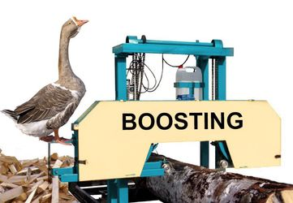

(topic10_intro)=

# Topic 10. Gradient Boosting

 

Gradient boosting is one of the most prominent Machine Learning algorithms, it finds a lot of industrial applications. For instance, the Yandex search engine is a big and complex system with gradient boosting (MatrixNet) somewhere deep inside. Many recommender systems are also built on boosting. It is a very versatile approach applicable to classification, regression, and ranking. Therefore, here we cover both theoretical basics of gradient boosting and specifics of most widespread implementations – Xgboost, LightGBM, and Catboost.

## Steps in this block

1\. Read the [article](topic10) (same as a [Kaggle Notebook](https://www.kaggle.com/kashnitsky/topic-10-gradient-boosting));

2\. Watch a video lecture on logistic regression coming in 2 parts:
 - the [theorical part](https://youtu.be/g0ZOtzZqdqk) covers fundamental ideas behind gradient boosting;
 - the [practical part](https://youtu.be/V5158Oug4W8), reviews key ideas behind major implementations: Xgboost, LightGBM, and CatBoost;

3\. Complete [demo assignment 10](assignment10) where you'll be beating baselines in a Kaggle "Flight delays" [competition](https://www.kaggle.com/c/flight-delays-fall-2018) provided a CatBoost [starter](https://www.kaggle.com/kashnitsky/mlcourse-ai-fall-2019-catboost-starter-with-gpu);

4\. Complete [Bonus Assignment 10](https://www.patreon.com/ods_mlcourse) where you'll be implementing gradient boosting from scratch (optional, available under Patreon ["Bonus Assignments" tier](https://www.patreon.com/ods_mlcourse)).
